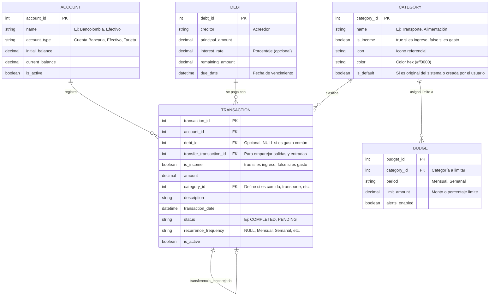

# Modelo Entidad-Relación (SeedCoin Offline)

### Notas Arquitectónicas (SQLite Offline)

*   **Transferencias Emparejadas:** Usando `transfer_transaction_id`, una transferencia entre cuentas genera dos registros en `TRANSACTION` (uno de salida en la Cuenta A, y uno de entrada en la Cuenta B) enlazados entre sí. Editar o borrar uno, debe afectar a su contraparte.
*   **Actualización de Saldos (Patrón Libro Mayor):** Para garantizar que `current_balance` (en `ACCOUNT`) y `remaining_amount` (en `DEBT`) nunca se descuadren por un bug en el código de la app, **se utilizarán Triggers de SQLite**. Esto significa que al insertar, editar o borrar una `TRANSACTION`, la base de datos se encargará automáticamente por debajo de sumar o restar el monto a las cuentas y deudas asociadas de manera atómica.
