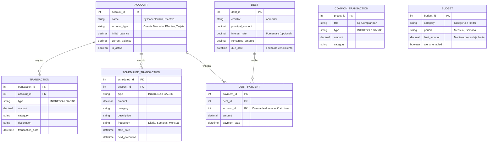

# Modelo Entidad-Relación (SeedCoin Offline)

```mermaid
erDiagram
    ACCOUNT ||--o{ TRANSACTION : "registra"
    ACCOUNT ||--o{ SCHEDULED_TRANSACTION : "ejecuta"
    DEBT ||--o{ DEBT_PAYMENT : "recibe"
    ACCOUNT ||--o{ DEBT_PAYMENT : "financia"

    ACCOUNT {
        int account_id PK
        string name "Ej: Bancolombia, Efectivo"
        string account_type "Cuenta Bancaria, Efectivo, Tarjeta"
        decimal initial_balance
        decimal current_balance
        boolean is_active
    }

    TRANSACTION {
        int transaction_id PK
        int account_id FK
        string type "INGRESO o GASTO"
        decimal amount
        string category
        string description
        datetime transaction_date
    }

    COMMON_TRANSACTION {
        int preset_id PK
        string title "Ej: Comprar pan"
        string type "INGRESO o GASTO"
        decimal amount
        string category
    }

    SCHEDULED_TRANSACTION {
        int scheduled_id PK
        int account_id FK
        string type "INGRESO o GASTO"
        decimal amount
        string category
        string description
        string frequency "Diario, Semanal, Mensual"
        datetime start_date
        datetime next_execution
    }

    BUDGET {
        int budget_id PK
        string category "Categoría a limitar"
        string period "Mensual, Semanal"
        decimal limit_amount "Monto o porcentaje límite"
        boolean alerts_enabled
    }

    DEBT {
        int debt_id PK
        string creditor "Acreedor"
        decimal principal_amount
        decimal interest_rate "Porcentaje (opcional)"
        decimal remaining_amount
        datetime due_date "Fecha de vencimiento"
    }

    DEBT_PAYMENT {
        int payment_id PK
        int debt_id FK
        int account_id FK "Cuenta de donde salió el dinero"
        decimal amount
        datetime payment_date
    }
```
