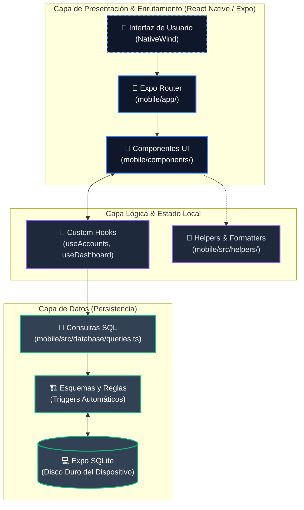

# Arquitectura del Sistema (SeedCoin)

SeedCoin está construido de forma puramente nativa bajo el marco conceptual de **Local-First / Offline-First**. A diferencia de aplicaciones web tradicionales o modelos "Client-Server", aquí no existe una dependencia constante a servidores o APIs en la nube para procesar lógicas de balance. Toda la riqueza, los datos de transacciones, cuentas y configuraciones persisten y se ejecutan 100% de manera encriptada y local en el dispositivo del usuario (`mobile/`).

## Diagrama Estructural (Capa de Bloques)

## Descripción de las Capas

### 1. Capa de Presentación (Frontend Visivo)
*   Ubicada principalmente en `mobile/app/` y `mobile/components/`.
*   Se encarga de estructurar la navegación mediante el sistema de **Expo Router v6**. Las carpetas definen las URL locales internas (e.j., `(tabs)/index.tsx`, `onboarding.tsx`).
*   Los estilos y diseños obedecen rígidamente al estándar de Tailwind incorporado a través de **NativeWind**.

### 2. Capa Lógica (Adaptador de Interfaz)
*   Ubicada en `mobile/src/database/hooks.ts`. Permite desacoplar el ciclo de vida de React del motor de Base de Datos.
*   En vez de ejecutar `SELECT` manuales desde la interfaz, los componentes "se suscriben" o invocan flujos como `const { totalBalance } = useDashboard()`.
*   Garantiza que la UI sea reactiva y solo recargue cuando existen mutaciones reales.

### 3. Capa de Datos Locales (Motor Interno SQLite)
*   **Triggers Inteligentes:** Al no depender de un Backend NodeJS/Java, funciones críticas (como recalcular el dinero actual de una cuenta tras crear un nuevo gasto) son ejecutadas de manera **automática y a prueba de fallos** directamente por el motor transaccional en `schema.ts`.
*   La ventaja fundamental es velocidad instantánea y no requerir conexión a internet para llevar un control estricto de las finanzas personales.
