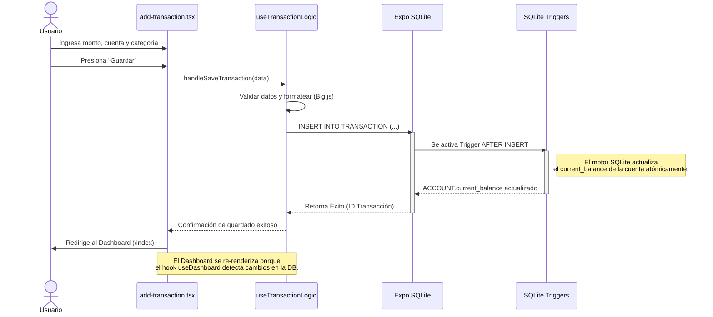

# Ciclo de Vida de una Transacción

Este diagrama de secuencia ilustra cómo interactúa la arquitectura **Offline-First** (React + Hooks + SQLite) al momento de crear una nueva transacción. Muestra el flujo desde que el usuario presiona "Guardar" hasta que los totales de la cuenta se actualizan automáticamente mediante Triggers.

### Características Clave
1.  **Sin Servidor Externo:** Todo el procesamiento ocurre en milisegundos de forma local.
2.  **Integridad de Datos:** Al utilizar SQLite Triggers para actualizar el balance de la cuenta, se evita el riesgo de que la UI (JavaScript) calcule mal o falle a mitad del proceso, protegiendo así la consistencia contable ("Financial Integrity").
3.  **Reactividad:** Los Custom Hooks escuchan los cambios en la base de datos y notifican a las pantallas correspondientes para que se actualicen al instante sin necesidad de un botón de recarga.
