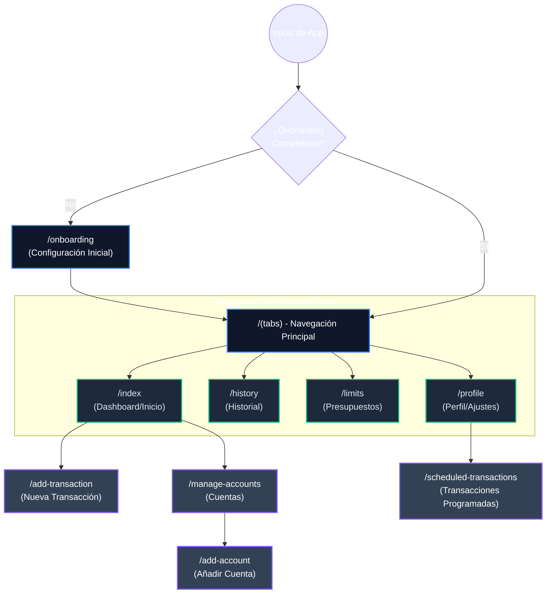

# Flujo de Navegación (User Flow)

Este diagrama representa la estructura de pantallas y la navegación principal de la aplicación SeedCoin, construida sobre **Expo Router v6**.

### Descripción de Rutas
*   **Pantallas Principales (`/tabs`):** Representan el ciclo diario del usuario (ver resumen, ver historial, revisar límites y ajustes).
*   **Modales/Acciones Directas:** Pantallas como `/add-transaction` o `/add-account` que se sobreponen para completar una tarea específica rápida y devolver al usuario a su flujo anterior.
